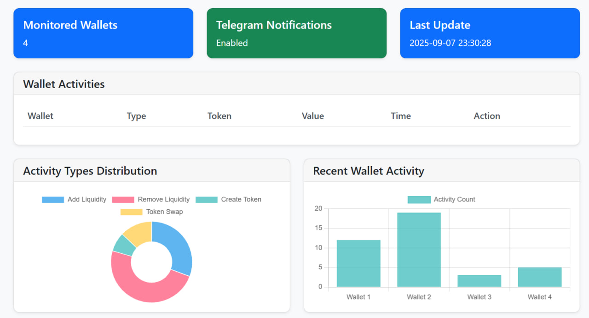
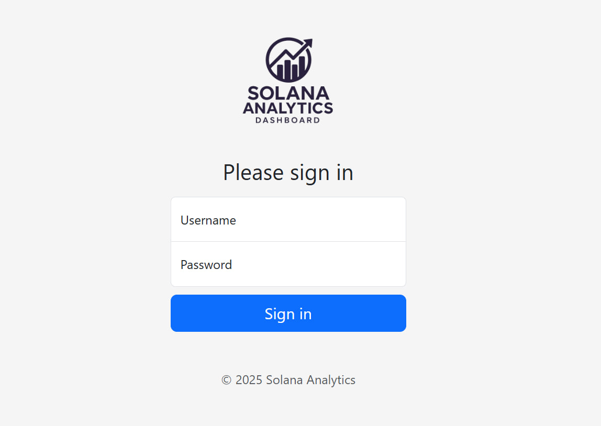
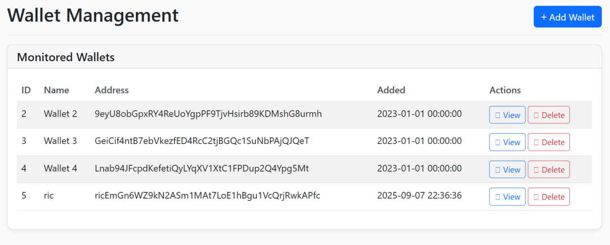
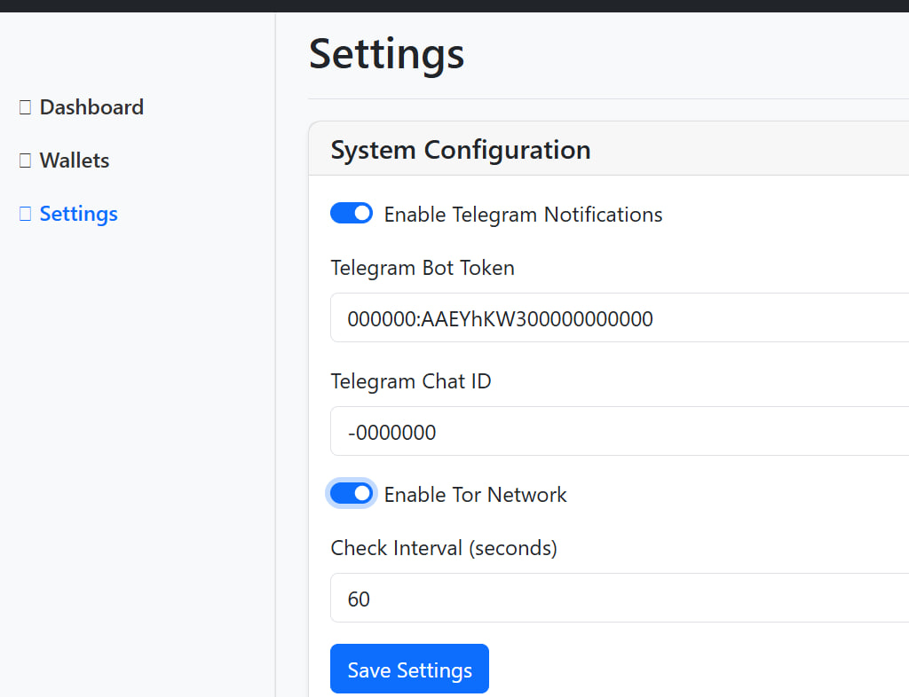
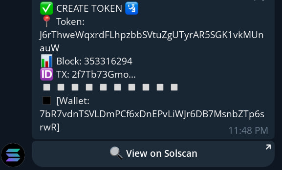
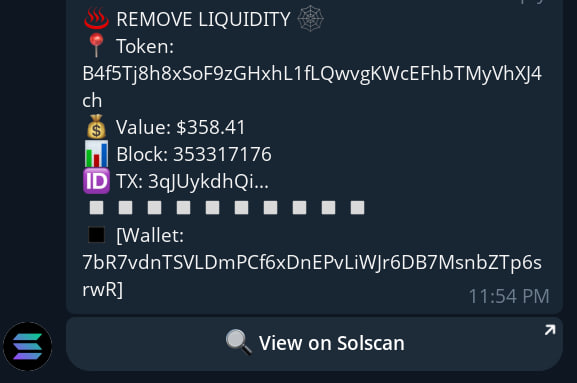

<div align="center">
  

  <h1>solana network monitor</h1>

  <p>Solana Wallet Monitor 🔍 - Real-time tracking of Solana wallet activities with Telegram alerts & Tor privacy support. Web dashboard for management.</p>

  <p>
    <a href="https://github.com/arash-aryapour/solana-network-monitor/stargazers">
      
    </a>
    <a href="https://github.com/arash-aryapour/solana-network-monitor/network">
      
    </a>
    <a href="https://github.com/arash-aryapour/solana-network-monitor/issues">
      
    </a>
    <a href="https://github.com/arash-aryapour/solana-network-monitor/blob/main/LICENSE">
      
    </a>
  </p>

</div>


# Solana Analytics & Monitoring Bot

A comprehensive monitoring system for tracking Solana wallet activities, providing real-time notifications via Telegram, and a web-based dashboard for management.

## 🌟 Features
-   **Real-time Monitoring**: Tracks Solana wallet activities including:
    -   Liquidity additions/removals
    -   Token creation (minting)
    -   Token swaps
    -   Other on-chain activities
-   **Telegram Integration**: Instant notifications with inline buttons to view transactions on Solscan
-   **Tor Network Support**: Optional Tor routing for enhanced privacy and IP rotation
-   **Web Dashboard**: Admin interface for managing wallets and settings
-   **Activity Tracking**: Persistent storage of all detected activities with duplicate prevention
-   **Image Customization**: Support for custom dashboard images and wallet icons
# 📸 Dashboard Screenshots

## 🖥️ Main Dashboard

*The main dashboard showing wallet statistics, recent activities, and system status*

## 🔐 Login Page

*Secure login interface with admin authentication*

## 👛 Wallet Management

*Wallet management interface for adding, viewing, and monitoring Solana addresses*

## ⚙️ Settings Panel

*System configuration panel for Telegram, Tor, and monitoring settings*

## 📱 Telegram Notifications
<div align="center">
  
  
</div>

*Sample Telegram notifications with inline buttons for quick actions*
## 🏗 Architecture
### Core Components
1.  **Bot Engine** (`bot.php`): Main monitoring script that periodically checks wallet activities
2.  **Web Dashboard**: Admin interface for configuration and monitoring
3.  **Database**: MySQL storage for wallets, activities, and settings
4.  **API Integration**: Solscan API for fetching wallet data
### File Structure
    ├── includes/
    │ ├── config.php # Configuration constants
    │ ├── database.php # Database connection class
    │ ├── functions.php # Utility functions
    │ ├── telegram_api.php # Telegram messaging functions
    │ └── auth.php # Authentication system
    ├── admin/
    │ ├── index.php # Login page
    │ ├── dashboard.php # Main dashboard
    │ ├── wallets.php # Wallet management
    │ ├── settings.php # System configuration
    │ └── logout.php # Logout handler
    ├── assets/
    │ ├── css/ # Stylesheets
    │ ├── js/ # JavaScript files
    │ └── images/ # Images and icons
    ├── api/ # API endpoints
    ├── install.php # Installation script
    ├── bot.php # Main monitoring bot
    └── index.php # Redirect to admin panel

## ⚙️ Configuration

### Database Configuration
-   `DB_HOST`: The hostname of your database server (e.g., 'localhost')
-   `DB_NAME`: The name of the database (e.g., 'solana_monitor')
-   `DB_USER`: The username for the database connection
-   `DB_PASS`: The password for the database user

### Default Admin Credentials
-   `DEFAULT_USERNAME`: The default username for the admin dashboard (default: 'admin')
-   `DEFAULT_PASSWORD`: The default password for the admin dashboard (default: 'admin123'). Change this after installation.

### Telegram Configuration
-   `TELEGRAM_TOKEN`: The authentication token for your Telegram bot. Obtain this from [@BotFather](https://t.me/BotFather) after creating a new bot.
-   `TELEGRAM_CHAT_ID`: The unique identifier for the chat where notifications will be sent. This can be:
    -   Your personal chat ID (get from [@userinfobot](https://t.me/userinfobot))
    -   A group ID (must be positive)
    -   A channel ID (must be prefixed with -100)

### Tor Configuration
-   `TOR_PASSWORD`: The password for authenticating with the Tor control port. This should be a hashed password generated using Tor's password hashing utility.
-   `TOR_CONTROL_PORT`: The port number where Tor is listening for control connections (default: 9050).

## 🚀 Installation
### Prerequisites
-   PHP 7.4+ with PDO MySQL extension
-   MySQL/MariaDB database
-   (Optional) Tor service for IP rotation
-   Web server (Apache/Nginx)
-   curl PHP extension
-   mbstring PHP extension

### Setup Steps
1.  **Configure Database**: Update `includes/config.php` with your database credentials:
``` php
define('DB_HOST', 'localhost');
define('DB_NAME', 'solana_monitor');
define('DB_USER', 'your_username');
define('DB_PASS', 'your_password');
```

2.  **Run Installation**: Navigate to `install.php` in your browser to:
    -   Create necessary database tables
    -   Insert default admin user (`admin/admin123`)
    -   Add sample Solana wallets

3.  **Configure Telegram**:
    -   Create a Telegram bot via [@BotFather](https://t.me/BotFather)
    -   Set the bot token in `includes/config.php`
    -   Configure your chat ID for notifications

4.  **Cron Job Setup**: Add the bot to run periodically:
``` bash
# Run every minute
* * * * * /usr/bin/php /path/to/your/bot.php >/dev/null 2>&1
```

## 🔧 Enabling Tor for the Bot

### Step 1: Install Tor
On Ubuntu/Debian:
```bash
sudo apt update
sudo apt install tor
```

On CentOS/RHEL:
```bash
sudo yum install epel-release
sudo yum install tor
```

### Step 2: Configure Tor
Edit the Tor configuration file:
```bash
sudo nano /etc/tor/torrc
```

Add or uncomment these lines:
```
ControlPort 9050
HashedControlPassword 16:DBEA9251E1B8DD9A60E3F1870FF3EFB2CF715C99D7E9D64AD3E846FB0E
```

### Step 3: Generate Hashed Password
To generate a new hashed password:
```bash
tor --hash-password "your_secure_password"
```
Replace the example hash in torrc with your generated hash.

### Step 4: Restart Tor
```bash
sudo systemctl restart tor
sudo systemctl enable tor
```

### Step 5: Verify Tor is Running
```bash
sudo systemctl status tor
sudo netstat -an | grep 9050
```

### Step 6: Configure the Bot
In `includes/config.php`, set:
```php
define('TOR_PASSWORD', "your_secure_password");
define('TOR_CONTROL_PORT', "9050");
```

### Step 7: Enable Tor in Dashboard
1. Login to the admin dashboard
2. Go to Settings
3. Enable "Tor Network Support"
4. Save settings

## ⚙️ Configuration
-   **Telegram Notifications**: Enable/disable and configure bot credentials
-   **Tor Network**: Toggle Tor routing for API requests
-   **Check Interval**: Frequency of wallet checks (in seconds)
-   **Wallet Management**: Add/remove Solana wallets to monitor
-   **Image Customization**: Upload custom logos and backgrounds

### Default Wallets
The system includes four sample wallets by default:
-   `88R7vdnTSVLDmPCf6xDnEPvLiWJr6DB7MsnbZTp6srwR`
-   `9ey888bGpxRY4ReUoYgpPF9TjvHsirb89KDMshG8urmh`
-   `GeiCif4ntB7ebVkezfED888C2tjBGQc1SuNbPAjQJQeT`
-   `Lnab94JFcpd22fetiQyLYqXV1XtC99PDup2Q4Ypg5Mt`

## 🔧 Usage
### Monitoring Bot
-   Checks each wallet's activities via Solscan API
-   Detects new activities (liquidity changes, swaps, mints)
-   Sends Telegram notifications
-   Rotates IP via Tor (if enabled)
-   Logs all activities to database

### Dashboard Features
-   Real-time activity view
-   Wallet management
-   System configuration
-   Activity statistics
-   Custom image support

## 🛡 Security
-   Password hashing with bcrypt
-   SQL injection prevention with PDO
-   Optional Tor routing for anonymity
-   Session-based authentication
-   Input validation and sanitization

## 📊 API Integration
-   Endpoint: `https://api-v2.solscan.io/v2/account/activity/dextrading`
-   Parameters: wallet address, pagination
-   Built-in delays to avoid rate limits
-   Tor support for IP rotation

## 🔔 Notifications
-   **Liquidity Addition** (`ACTIVITY_TOKEN_ADD_LIQ`)
-   **Liquidity Removal** (`ACTIVITY_TOKEN_REMOVE_LIQ`)
-   **Token Creation** (`ACTIVITY_SPL_INIT_MINT`)
-   **Token Swaps** (`ACTIVITY_AGG_TOKEN_SWAP`)
-   Other activities (generic format)

## 🚨 Troubleshooting
-   **API Errors**: Check connectivity, Tor config, rate limits
-   **Telegram Issues**: Verify token, chat ID, bot permissions
-   **Database Errors**: Verify credentials and DB availability
-   **Tor Issues**: Ensure Tor service is running and control port is accessible
-   **Image Issues**: Verify file permissions and correct file paths

## 📈 Performance
-   Adjust check interval based on wallet count
-   Enable Tor only if required
-   Monitor DB growth, archive old data
-   Stay within API rate limits
-   Optimize image sizes for faster loading

## 📝 License
Proprietary software. All rights reserved.

> Note: This system is for monitoring and educational purposes. Ensure compliance with laws and regulations.

<div align="center">

  <p>
    <a href="https://github.com/arash-aryapour">
      
    </a>
    <a href="https://twitter.com/Arash_Ary">
      
    </a>
    <a href="https://linkedin.com/in/arash-aryapour">
      
    </a>
  </p>
</div>
